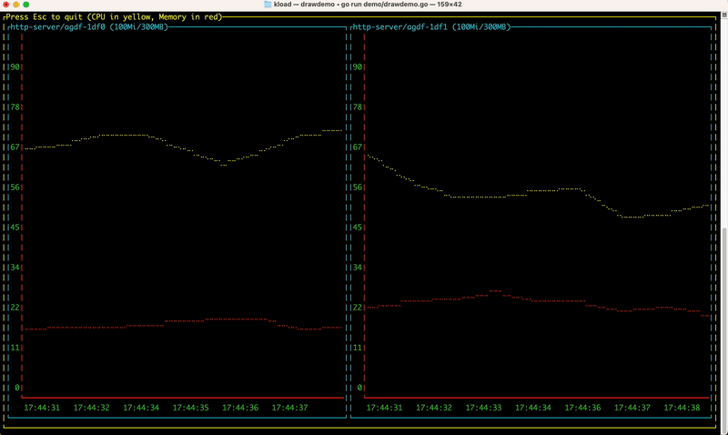
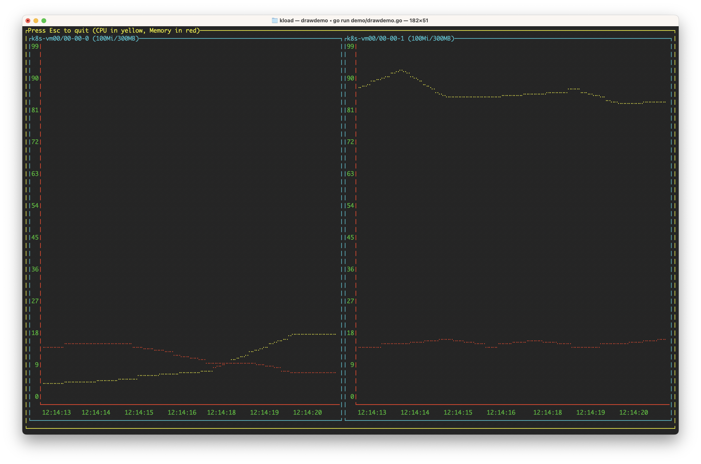
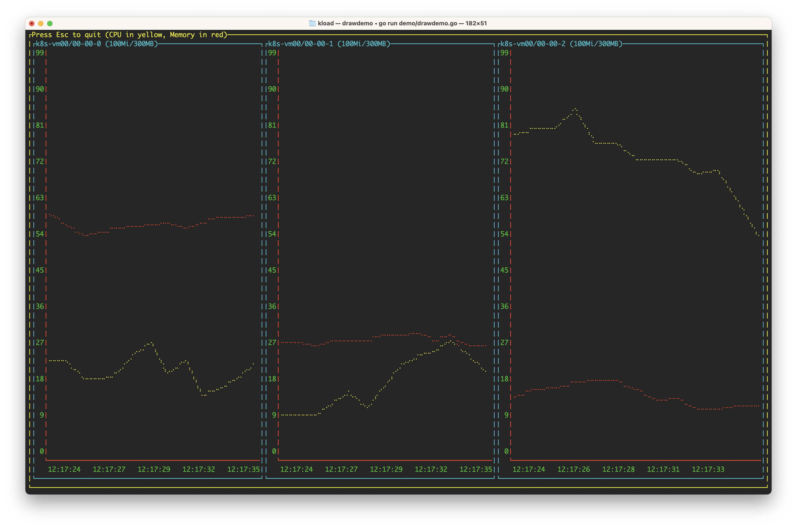
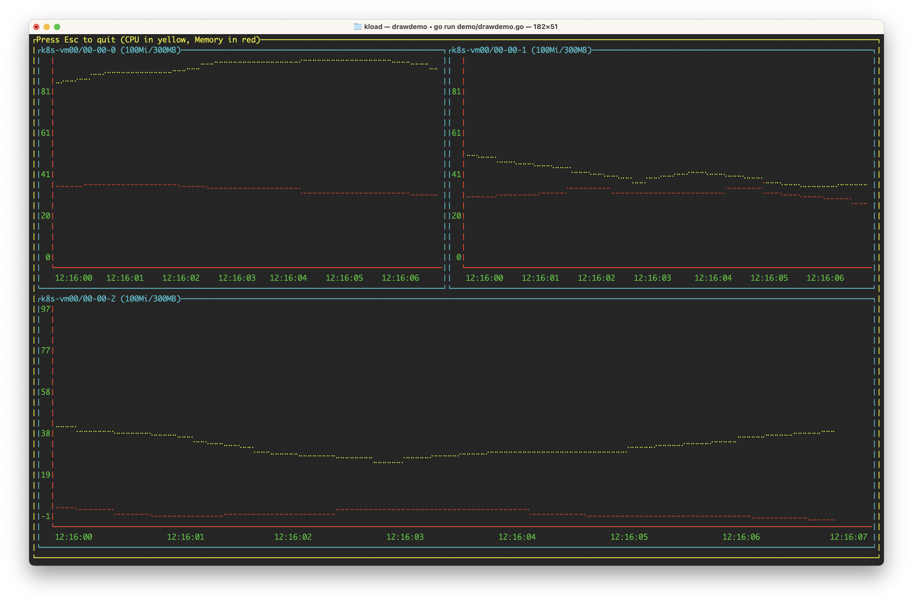

# Kload

Kload shows cpu and memory load on nodes and pods in your kubernetes cluster. Kload uses your kubectl setup
to show information about your cluster.

[](demo/drawdemo.go)

## Installation

You must have [kubectl](https://kubernetes.io/docs/reference/kubectl/) installed on your machine and [metrics](https://github.com/kubernetes-sigs/metrics-server) enabled for your kubernetes cluster.
Most likely you have them both installed. 

### Source
```
go install github.com/raffepaffe/kload@latest
```


## Usage

Kload shows a line graph with CPU percentage used in yellow and memory percentage in red. Each pod and container name is seen
on the top of each graph together with cpu and memory limits.

### Show cpu and memory for the nodes in your cluster

Show all nodes in your cluster
```
kload -node
```
[]()

The default value for the number of columns is set to three. If you have three nodes your output will look like this.
[]()

You can adjust the numer of columns with the column parameter. 
```
kload -node -columns 2
```
[]()

You can show only the nodes you are interested in by listing the node names. This will show node-000 node-001.
```
kload -node node-000 node-001
```

### Show cpu and memory for the pods and containers in your cluster

Show the pods in the prod namespace
```
kload -pod -ns prod  
```

Show the pods in the prod namespace, two columns wide and with the namne http-server and app-server
```
kload -pod -ns prod -columns 2 http-server app-server
```

Show the pods in the prod namespace, two columns wide, the pod name can't contain app or http, with the name server.
You can use regexp with the -vp flag.
```
kload -pod -ns prod -columns 2 -vp 'app|http' server
```

Show the pods in the prod namespace, two columns wide, the name of the containers can't contain app or http, with the name server.
You can use regexp with the -vc flag.
```
kload -pod -ns prod -columns 2 -vc 'app|http' server
```

## Issues

- Graph lines will bleed over if they come to close to each other.
- Pods and nodes that exist when kload is started are shown. If you deploy new ones or redeploy them, they will not show up.
- During development, I didn't use TDD as I usually do. No tests -> probably has bugs.
- Draw function is too long and needs to be refactored.

## Credits

The idea for this came during a time when I was trying to find a memory leak. I needed to continuously monitor some of my pods
and I was trying to understand how memory management worked in kubernetes.

Credit goes to (in alphabetic order) Anders, Björn and Hampus for
helping me become a better Go developer.

## Contributing

As with most tools, this will likely miss some cases. If you come across a case which you
think should be covered and isn't, please file an issue including a minimum reproducible example of the case.

## License

This project is licensed under the MIT license. See the [LICENSE](./LICENSE) file for more
details.